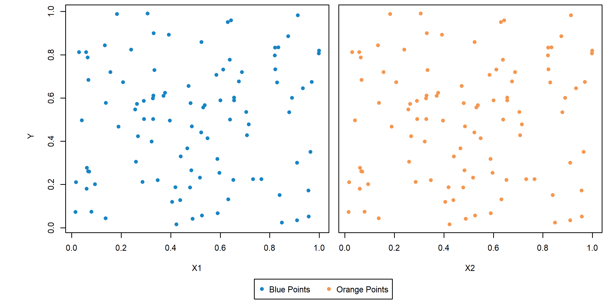
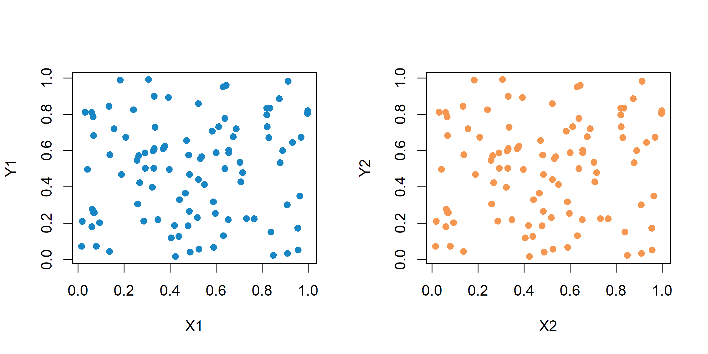
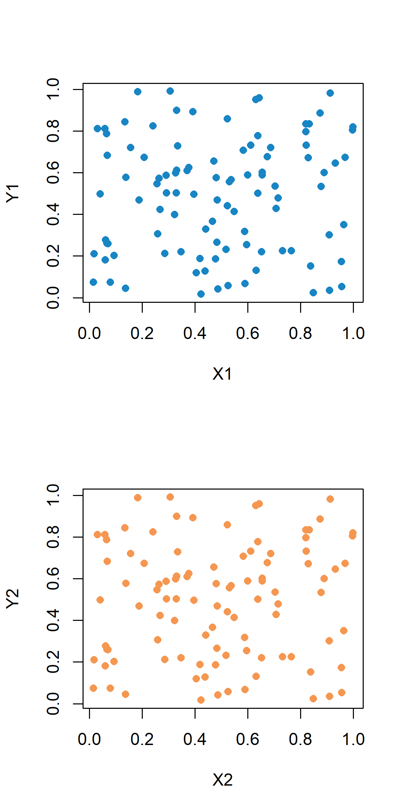
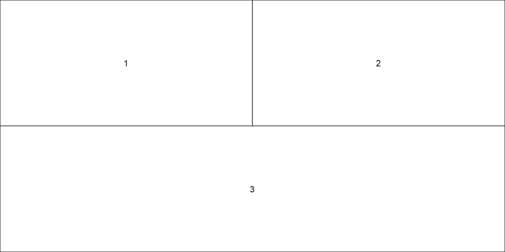
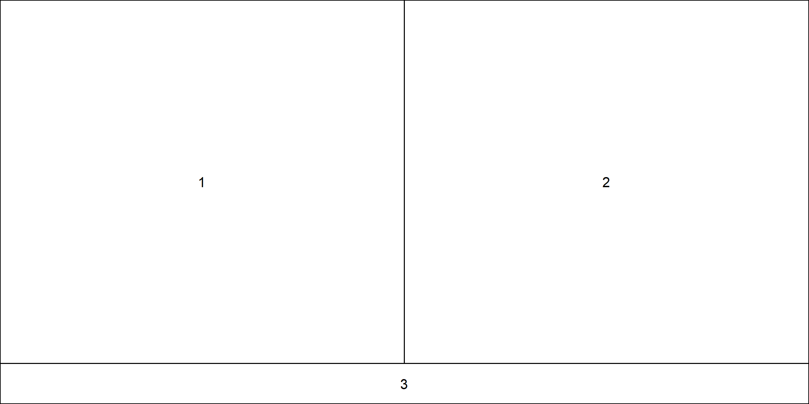
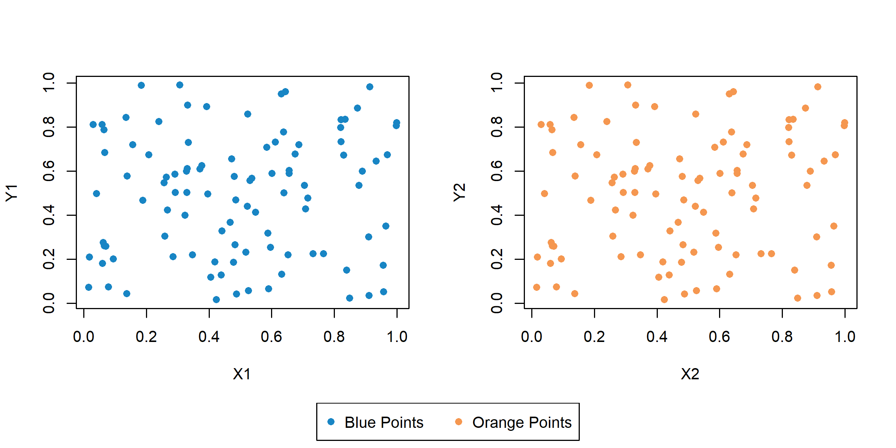
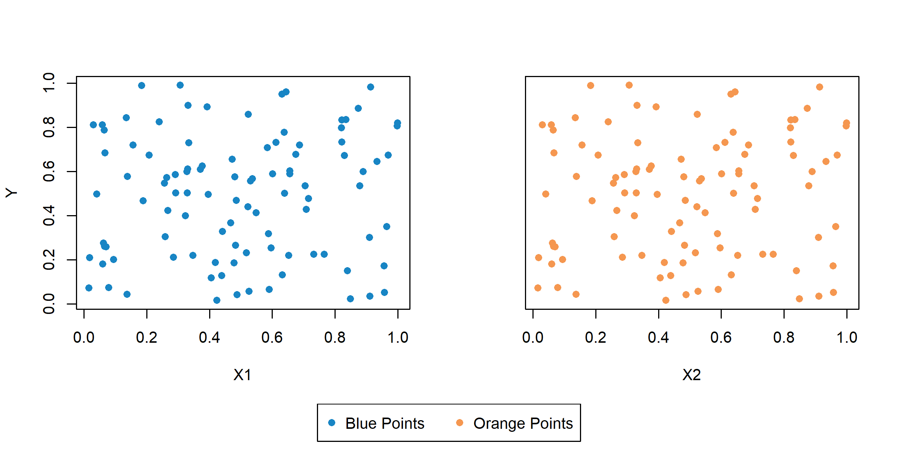

<!--  -->

The questions that will be answered in this post are :
1. How do you make plots with subplots in R?
2. Above + how do you have a common legend outside the subplots? (subplots with common legend in R)
3. Above + how do you share axes between subplots?

We want to be able to make plots such as the following:

## Data used for plotting
The data plotted would ideally not influence the final plot. I use the following:

~~~r
x = runif(100)
y = runif(100)
~~~

## Basic subplots in R

The easiest subplot is using par. For two columns, this is done as follows :

~~~r
png("subplot1.png", height=4, width=8, units="in", res=300)
par(mfrow=c(1,2)) # For one row, two columns
plot(x, y, xlab="X1", ylab="Y1", col=c1, pch=16)
plot(x, y, xlab="X2", ylab="Y2", col=c2, pch=16)
dev.off()
~~~

Two rows and one column is easy as calling `par(mfrow=c(2,1)` . The following snippet

~~~r
png("subplot2.png", height=8, width=4, units="in", res=300)
par(mfrow=c(2,1))
plot(x, y, xlab="X1", ylab="Y1", col=c1, pch=16)
plot(x, y, xlab="X2", ylab="Y2", col=c2, pch=16)
dev.off()
~~~

produces the following plot:

<!-- ![plot2]

[plot2]: ../assets/rplotlegendshareaxes/subplot2.png
{: height="36px" width="36px"} -->

<!-- 

<figure style="height: 600px" class="align-center">

<figcaption>LOOK AT THIS CAPSHUN</figcaption>
</figure>

 -->

## Common legend with subplot
To create a common legend, I use the layout function that comes along with base R. No need to install additional packages. The first step is recreating the two subplots as in the previous case. The snippet that does this is :

~~~r
png("subplot3.png", height=4, width=8, units="in", res=300)
layout(matrix(c(1,2), ncol=2, byrow=TRUE))
plot(x, y, xlab="X1", ylab="Y1", col=c1, pch=16)
plot(x, y, xlab="X2", ylab="Y2", col=c2, pch=16)
dev.off()
~~~

Now to better understand what is going on, we can visualize the layout using:

~~~r
png("subplot4.png", height=4, width=8, units="in", res=300)
layout(matrix(c(1,2), ncol=2, byrow=TRUE))
layout.show(n=2) # number of subplots to show on the layout
dev.off()
~~~

So we see that the layout function divides the plot region into two parts. It does this based on the input `matrix(c(1,2), ncol=2, byrow=TRUE))`. We will use this property to divide the plot region into three parts. Two parts will be in the top row, each holding a plot. The third part (Part 3) will span the entire bottom row, holding the legend. To do this, we create the layout as follows:

~~~r
png("subplot5.png", height=4, width=8, units="in", res=300)
layout(matrix(c(1,2,3,3), ncol=2, byrow=TRUE))
layout.show(n=3)
dev.off()
~~~

Note that the `matrix(c(1,2,3,3), ncol=2, byrow=TRUE)` will create a matrix [[1, 2], [3, 3]]. We want 3 subplots to show up on the layout, so we use `layout.show(n=3)`. This resembles what we want our layout to look like.

<figure class="align-center">

<figcaption>Ugh.</figcaption>

</figure>

Of course, it wasn’t going to be that simple. Part 3 is taking up too much space. To fix this, I use the following slightly modified version:

~~~r
png(“subplot6.png”, height=4, width=8, units=”in”, res=300)
layout(matrix(c(1,2,3,3), ncol=2, byrow=TRUE), heights = c(0.9,0.1))
layout.show(n=3)
dev.off()
~~~

The heights parameter of the layout function helps specify the relative heights of the top and bottom parts. This gives the following plot:

<figure class="align-center">

<figcaption>Much better.</figcaption>
</figure>

Now the actual plot making code is:

~~~r
png("subplot7.png", height=4, width=8, units="in", res=300)
layout(matrix(c(1,2,3,3), ncol=2, byrow=TRUE), heights = c(0.9,0.1))
plot(x, y, xlab="X1", ylab="Y1", col=c1, pch=16)
plot(x, y, xlab="X2", ylab="Y2", col=c2, pch=16)
par(mar=c(0,0,0,0)) # Make the margins 0
plot(1, type = "n", axes=F, xlab="", ylab="") # Create empty plot
legend("top", c("Blue Points", "Orange Points"), horiz=TRUE,
pch = c(16, 16), col=c(c1, c2))
dev.off()
~~~

Two things to note are
1. `par(mar=c(0,0,0,0))` – The reason for the first part is that by default, the plot margins tend to be quite big. Too big to fit in the small Part 3. Setting the margins to 0 fixes this.
2. `plot(1, type = "n", axes=FALSE, xlab="", ylab="")` – This creates an empty plot. Creating a legend is necessarily preceded by creating a plot in the first place. The above command creates an empty plot, and the legend function can be called after this.

This gives the following plot:

## Sharing axes
Now suppose that the two plots share the same units on the y axis and also similar ranges of the data. Then it makes sense to remove the y axis tick marks and the associated tick labels, we do this with the following snippet:

~~~r
png("subplot8.png", height=4, width=8, units="in", res=300)
layout(matrix(c(1,2,3,3), ncol=2, byrow=TRUE), heights = c(0.9,0.1))
plot(x, y, xlab="X1", ylab="Y", col=c1, pch=16)
plot(x, y, xlab="X2", ylab="", yaxt="none", col=c2, pch=16)
par(mar=c(0,0,0,0)) # Make the margins 0
plot(1, type = "n", axes=FALSE, xlab="", ylab="") # Create empty plot
legend("top", c("Blue Points", "Orange Points"), horiz=TRUE,
pch = c(16, 16), col=c(c1, c2))
dev.off()
~~~

You would think “Yes, that’s it! It’s done!”. You would be wrong. We get the following plot:

<figure class="align-center">

<figcaption>Ugggh.</figcaption>
</figure>

The gap between the plots is too wide. There are probably other ways to address this gap, but the solution that worked for me is creating a new layout to hold the common y axis label. Some things to keep in mind while doing this:
1. The new layout should have 2 rows, but 3 columns. In the top row, the first part in the layout will hold the y label. The second and third parts will hold the plots. Row 2 will hold the legend.
2. The margins also have to be altered for the y label, the plots and the legend. (Note that once altered, the margin values stay the same until they are altered again).
3. The legend will have to be manually placed. This is trial and error. (*What fun!*)

~~~r
png("subplot9.png", height=4, width=8, units="in", res=300)
layout(matrix(c(1,2,3,4,4,4), ncol=3, byrow=TRUE),
heights = c(0.9,0.1),
widths = c(0.1,0.45,0.45))
par(mar=c(0,0,0,0)) # Make the margins 0 for y label
plot(1, type = "n", axes=FALSE, xlab="", ylab="") # Create empty plot
text(1,1,labels="Y", srt=90) # Create y label
par(mar=c(4.0,0.5,0.5,0.5)) # Make the margins non-zero for plots
plot(x, y, xlab="X1", ylab="", col=c1, pch=16)
plot(x, y, xlab="X2", ylab="", yaxt="none", col=c2, pch=16)
par(mar=c(0,0,0,0)) # Make the margins 0 for legend
plot(1, type = "n", axes=FALSE, xlab="", ylab="") # Create empty plot
legend(x=0.93, y=1.25, c("Blue Points", "Orange Points"), horiz=TRUE,
pch = c(16, 16), col=c(c1, c2)) # Manual placement of legend
dev.off()
~~~

The plot, after much adventure, looks like this:

This is the point at which, if this were a textbook, I would ask you to “Create a 2 row 1 column plot in R using the layout command. Share the X axis between the subplots. Create a common legend for these subplots and place it to the right of the subplots.”