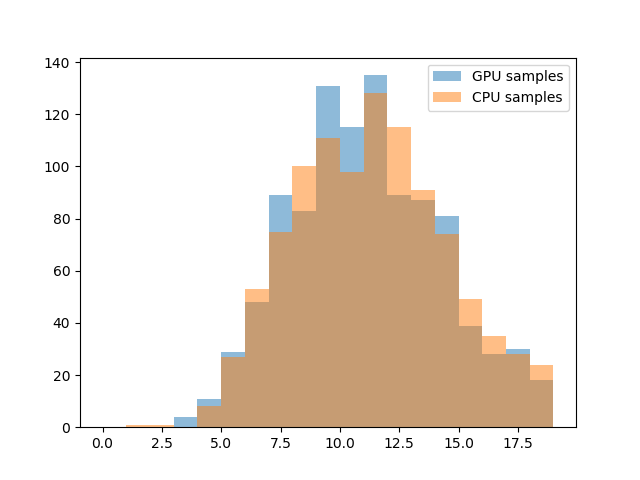

<!---comment to remove Goal from showing up below teaser--->

# Goal

Demonstrate how to generate Poisson distributed random numbers using PyCUDA. 

# Background

The Poisson distribution is used to model the number of times an event occurs in a time interval, given that the event has a known constant rate of occuring. For example, one gets emails at an average of $$\lambda$$=20/day. Then the number of emails received in *t* days, $$X(t)$$, follows:

$$X(t) \sim \textrm{Poisson}(\lambda t)$$

The Poisson distribution models the number of events, and hence samples of $$X(t)$$ will be restricted to integer values. $$\lambda t$$ need not be restricted to integer values, however!

# Code

The following Python code will generate Poisson random numbers on the GPU and return them to be used further in Python:

~~~python
import numpy as np
import atexit
from pycuda.compiler import SourceModule
import pycuda.driver as cuda
import pycuda.gpuarray as gpuarray
import pycuda.curandom
import matplotlib.pyplot as plt

# Function to initialize CUDA
def cudasetup(gpu_device_number=0):
    print("Initializing CUDA")
    cuda.init()
    device = cuda.Device(gpu_device_number)
    global context
    context = device.make_context()
    atexit.register(_finish_up)
    print("Succesfully initialized CUDA")

# Function for garbage collection in CUDA
def _finish_up():
    global context
    context.pop()
    context = None
    from pycuda.tools import clear_context_caches

    clear_context_caches()
    print("Finishing up")

# Sets the seed, for reproducibility
def set_seeder(N, seed):
    seedarr = (
        gpuarray.ones_like(gpuarray.zeros(N, dtype=np.int32), dtype=np.int32) * seed
    )
    return seedarr

if __name__ == "__main__":
    code = """#include <curand_kernel.h>
#include <stdio.h>
extern "C"
{
    __global__ void get_poisson_gpu(float pois_lambda, 
    int *pois_rand, 
    curandState *global_state)
    {
        int idx = blockIdx.x * blockDim.x + threadIdx.x;
        curandState local_state = global_state[idx];
        pois_rand[idx] = curand_poisson(&local_state, pois_lambda);
        global_state[idx] = local_state;
    }
}
    """

    # Define constants
    seed = 6
    size = 1024
    pois_lambda = 10.7
    block_size = 64

    # Initialize the gpu
    cudasetup()
    # Allocate memory on gpu
    sample_gpu_holder = gpuarray.empty(size, dtype=np.int32)
    # Define the random number generator
    _generator = pycuda.curandom.XORWOWRandomNumberGenerator(
        lambda N: set_seeder(N, seed)
    )
    max_size = _generator.generators_per_block
    if size // max_size > 1:
        raise ValueError("Too many generators expected")

    # Compile the kernel
    mod = SourceModule(code, keep=False, no_extern_c=True)
    cuda_function = mod.get_function("get_poisson_gpu")

    # Call the kernel
    cuda_function(
        np.float32(pois_lambda),
        sample_gpu_holder,
        _generator.state,
        block=(block_size, 1, 1),
        grid=(size // block_size + 1, 1),
    )

    # Retrieve memory from GPU
    sample_gpu_returned = sample_gpu_holder.get()
    sample_cpu = np.random.poisson(pois_lambda, size)
    hbins = np.arange(20)
    plt.hist(sample_gpu_returned, label="GPU samples", alpha=0.5, bins=hbins)
    plt.hist(sample_cpu, label="CPU samples", alpha=0.5, bins=hbins)
    plt.legend()
    plt.savefig("gpu_poisson.png")
~~~

This should generate a plot like this:

# Hardware and software

|---+---+---|
| GPU          | Nvidia GeForce 1030 |
| OS           | Windows 10          |
| Python       | 3.7.0               |
| CUDA Toolkit | 10.0                |
| PyCUDA       | 2018.1.1            |