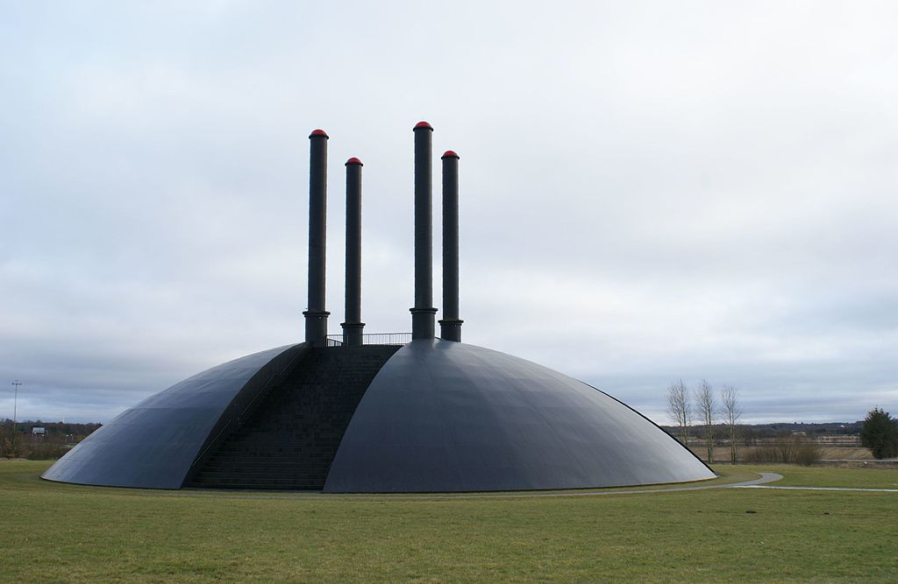
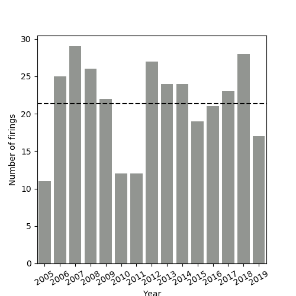
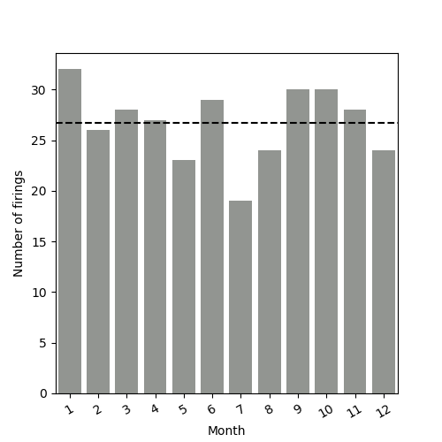
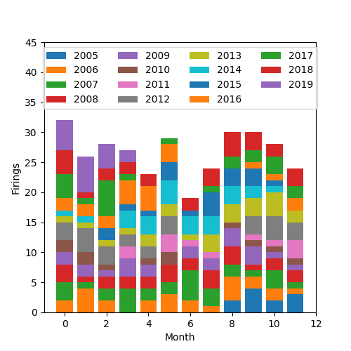
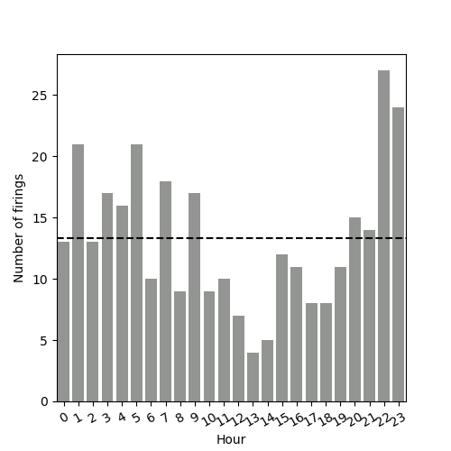
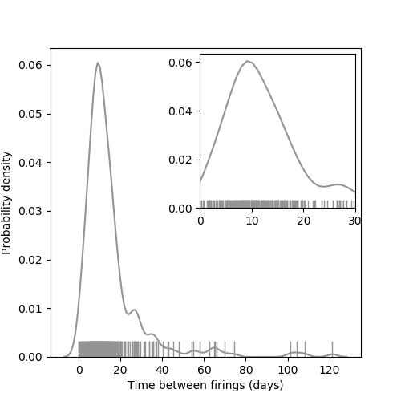

# Goal

Identify trends to see when it is more likely for Elia to fire.

## TLDR

1. January is the best month. Friday is the best day. 22:00 to 23:59 is the best time.
2. Firings happen on average, every 10 days.

# Background

Elia is a "sculpture" by Swedish-Danish artist Ingvar Cronhammar. I use the term "sculpture" loosely as it looks like this:

<figure class="align-center">

<figcaption>Elia. Shot by <a href="https://en.wikipedia.org/wiki/File:Elia_I_-_panoramio.jpg">Jens Cederskjold.</a></figcaption>
</figure>

It also erupts at random, shooting up a pillar of fire [~1 meter wide and 8.4m high](https://elia.dk/en/bag-om-elia/). I came across it in [this video](https://www.youtube.com/watch?v=4gE9qxX5VjE).

While it seems to erupt at random, I wanted to see if there were trends in the eruption. The time of every eruption is recorded on the official website [here](https://elia.dk/en/udbrud/).

## Tools

I analyzed the data using `Python` and the built-in `datetime` with a little help from `Pandas` and `matplotlib` + `seaborn` for plotting. In the following plots, dashed lines indicate the average.

# Trends

## Year

I want to see a pattern in the years, but I am not sure if there is one. One possible pattern is that every year's count is near the previous year's count. Of course, 2010 (and 2012) seem to have little to do with previous years. 

I think 2019 is going to be a record year, because we are only ~5 months down and already more than half of last year's count (2019:17, 2018: 28).

## Month

- January, September and October have recorded most firings in the past.
- July and May have the fewest, followed by August and December.

### Month and year

- June and July had zero firings in some years.
- Don't see any bigger/more obvious trends.

## Hour

- 22:00-23:59 seems to be best two hours for a firing.
- Lunch time seems to be worst few hours for a firing.

# How frequently does Elia fire?

To answer this question, I computed the duration between consecutive firings.

- Most common duration of time between firings seems to be 10 days.
- There is a second peak around 25 days.
    - My hunch is that the second peak points to the June/July period when the overall firings are low.
- However, distribution has a heavy tail. So sometimes, you may have to wait much longer.

# When will Elia fire next?

From the above analysis, the simplistic answer is approximately every 10 days, usually between 22:00-23:59. January, September and October are favourable months. Friday appears more likely too.

A more detailed study accounting for any potential correlations (for example, all firings in May could happen in the evening) would give a better answer.

## Caveats

- While cleaning the data, I had to remove two entries (13-16-*16* at 18:53, 02-03-16 at 08:*80*) since these dates don't make any sense. These could have contributed to the skew of the duration plot.
- While the dates on the site appear to be listed in order, they are not. For example (08-05-14 at 05:21) appears above (11-11-14 at 15.43). 
    - Potentially, entries such as these could be errors in data entry.
